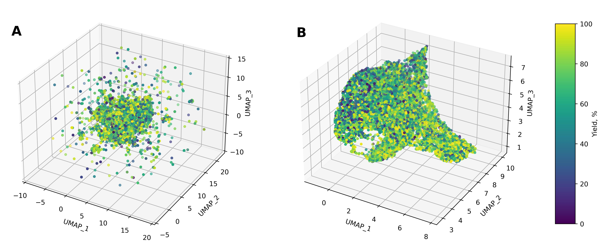

# Are Large Language Models the Best Estimators of Chemical Reaction Yields?

Chemical reaction yield, defined as the percentage of reactants turned into products, is the main criterion for selecting reaction conditions and evaluating success of a synthesis. Various machine learning (ML) models have been reported to predict reaction yields based on high-throughput experiment datasets. However, in the face of sparse and insufficient data typical for regular laboratory experiments, the performance and applicability of such models remain limited. More recently, the capabilities of large language models (LLMs) have been explored in predictive chemistry. Following up on this work, ***we investigate how LLMs perform in the generalized yield prediction task treated as a binary classification problem***. In this regard, we engineer four different chemical reaction datasets to systematically evaluate performance of the top rated LLMs. We demonstrate that in the few-shot classification task LLMs outperform baseline approaches in F1-score up to 9\% and show competitive performance in terms of accuracy. Moreover, we observe superiority of ML models trained on LLM embeddings with the best average accuracy of 0.70 versus 0.67 achieved with current state-of-the-art approaches on the USPTO data. In this context, we discuss the potential of LLM embeddings to become the new state-of-the-art chemical reaction representations. Additionally, we share our empirical results on practical aspects of the few-shot LLM classifiers, such as the optimal size of the training set, and discuss peculiarities and prospects of the proposed methods.

This repository complements our study submitted to NeurIPS 2024. Below you can see the steps needed to reproduce paper results.

## :pushpin: Preparation of datasets
The notebooks regarding datasets preparation process can be found in the [datasets_prep_notebooks](./datasets_prep_notebooks) folder. The resulting USPTO-R, USPTO-C, ORD-R and ORD-C datasets as well as USPTO-R based datasets with different train sizes are provided in the [data](./data) folder for your convenience.

## :pushpin: Few-shot classification
The code needed to reproduce few-shot classification experiments is provided in the [few_shot_classifier](./few_shot_classifier/) folder.

### User guide

`pip install requirements.txt` 
`python -m classifier <path_to_config_file>`

### Config file structure

**name=name**  - any identifier for your experiments folder 
**subject=chemistry** - area of your experiments 
**provider=openai** - provider (openai, mistral, anthropic are available) 
**engine=gpt-4** - LLM name 
**dataset=./data/dataset.csv** - path to the dataset 
**data_format=text** - data format ("text" if your data is in the format of sentences, "table" if your data is in the format of features) 
**classes=class_1,class_2** - classes of your data (the same as in your dataset, comma-separated, without spaces) 
**n_for_train=7** - number of examples in prompt 
**seed=36** - random seed needed to obtain reproducible results 
**enable_metrics=True** - whether to calculate metrics for the experiment or not 

Example of the config file is provided in the folder.

If you want to run multiple experiments in one pipeline, you can create configs with [create_config.py](./few_shot_classifier/create_config.py), then run the [run_commands.py](./few_shot_classifier/run_commands.py) and gather the obtained experimental parameters and corresponding metrics using the [gather_metrics.py](./few_shot_classifier/gather_metrics.py).

## :pushpin: Analysis of few-shot results
The notebooks with the few-shot results analysis are provided in the [few_shot_notebooks](./few_shot_notebooks/) folder.  We also provide .csv files with metrics for different experiments, however you can obtain them yourself by reproducing the few-shot experiments as suggested in the previous section.

## :pushpin: LLM embeddings extraction

The code needed to extract reactions embeddings from text-embedding-3-large (OpenAI) and Mistral 7B (MistralAI) is provided in [openai_emb_gen](./openai_emb_gen/) and [mistralai_emb_gen](./mistralai_emb_gen/) folders.

### OpenAI embeddings extraction

1. The dataset should contain only one column without indices.
2. `pip install -r requirements.txt`
3. `python cli.py <path_to_dataset.csv> --engine <engine_name>` (text-embedding-3-large and text-embedding-3-small are available)
4. Output in result.json

### Mistral 7B embeddings extraction

1. `pip install -r requirements.txt`
2. `python cli.py <path_to_dataset.csv>`
3. Output in result.json.

## :pushpin: Training XGB on DRFPs and LLM embeddings

Scripts for running grid-search and evaluation of XGB models trained on DRFPs and LLM embeddings are provided in the [xgb_drid_search](./xgb_grid_search/) folder.

`python xgb_gs_drfp.py <path_to_smiles_dataset.csv> > result.txt` 
`python xgb_gs_embeddings.py <path_to_llm_embeddings_dataset.csv> <path_to_smiles_dataset.csv> > result.txt`
